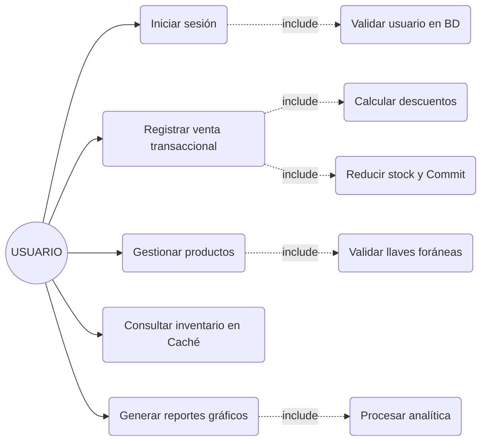
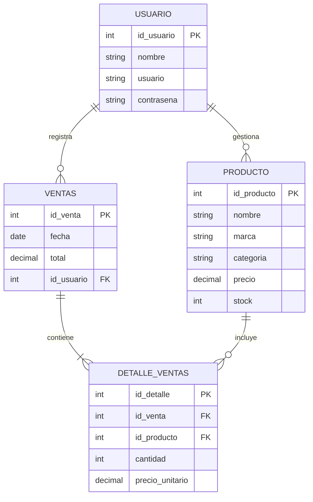

# UNIVERSIDAD TECNOLÓGICA DEL PERÚ

**Curso Integrador I: Sistemas Software**

**Tema:** Avance de Proyecto Final (1-2)

**Caso:** Sistema de Control de Ventas para Negocios de Laptops y Computadoras

**Sección:** 28648

**Integrantes:** 
* Diego Alonso Mejia Huisacayna
* Fabian Mauricio Chaisa Arapa
* Duvan Isai Davila Guerra
* Gabriela Ysabel Romero Chirinos
* Bryan Francescoly Zeballos Ticona

**Docente:** Juan Ramirez Ticona

Arequipa, Perú
2026

---

## ÍNDICE

1. Análisis del contexto
   1.1 Contexto de la empresa
   1.2 Problema identificado
   1.3 Alcance de la solución
   1.4 Visión
   1.5 Misión
   1.6 Entorno
   1.7 Strategies de la Empresa
   1.8 Planes de la Empresa
2. Análisis Del Sistema
   2.1 Descripción General del Sistema
   2.2 Actores del Sistema
   2.3 Casos de Uso del Sistema
   2.4 Diagramas de Entidad Relación
   2.5 Requisitos Funcionales (RF)
   2.6 Requisitos No Funcionales (RNF)
   2.7 Priorización de Requisitos
   2.8 Supuestos y Restricciones
   2.9 Criterios de Aceptación
3. Diseño de la solución y Construcción del Producto Final
   3.1 Diseño de Arquitectura del Sistema (MVC y Filtros de Seguridad)
   3.2 Patrones de Diseño Aplicados (TDD, DAO, SOLID)
   3.3 Implementación de Librerías (Guava, Logback, POI, Commons)
   3.4 Diseño de Base de Datos y Transacciones ACID
   3.5 Diseño de Interfaces de Usuario
   3.6 Control de Versiones (Git/GitHub)
   3.7 Reporte Detallado de Pruebas de Seguridad y Observaciones Levantadas
   3.8 Plan de Monitoreo Exhaustivo del Sistema
   3.9 Plan de Mantenimiento Integral
4. Autoría y Distribución del Trabajo
5. Lean Canvas
6. Mockups
7. Porcentaje de Avance en GitHub

---

## 1. Análisis del contexto

### 1.1 Contexto de la empresa
Los negocios pequeños de venta de laptops y computadoras suelen manejar sus ventas e inventario de forma manual (cuadernos o Excel), lo que dificulta el control y la organización del negocio.

### 1.2 Problema identificado
Falta de un sistema digital para:
* Registrar ventas correctamente y calcular descuentos aplicables.
* Controlar el stock y recibir alertas de stock bajo.
* Generar reportes analíticos de ingresos y productos populares.

Esto ocasiona errores, pérdida de información y mala toma de decisiones.

### 1.3 Alcance de la solución
Sistema web desarrollado en Java que cubre al 100% las siguientes funcionalidades:
* **Registrar ventas:** Con procesamiento transaccional y aplicación de descuentos automáticos.
* **Gestionar productos:** CRUD completo validado contra la base de datos.
* **Controlar inventario:** Visualización en tiempo real desde memoria caché y alertas de stock menor a 5 unidades.
* **Generar reportes:** Gráficos de ingresos mensuales, ventas por categoría y Top 5 de productos más vendidos.

Dirigido a pequeños negocios, con uso simple.

### 1.4 Visión
Ser una solución simple, confiable y con una arquitectura robusta para mejorar la gestión de ventas e inventario en negocios tecnológicos.

### 1.5 Misión
Desarrollar un sistema web transaccional en Java que automatice y facilite el control de ventas, productos e inventario mediante buenas prácticas de ingeniería de software.

### 1.6 Entorno
* **Tecnológico:** Equipos básicos, despliegue en servidor web Tomcat.
* **Económico:** Presupuesto limitado, uso de herramientas Open Source (Java, PostgreSQL).
* **Social:** Usuarios con conocimientos básicos (requiere interfaz intuitiva).

### 1.7 Estrategias de la Empresa
#### 1.7.1 Estrategia de Digitalización
Reemplazar procesos manuales centralizando los datos en una base de datos relacional PostgreSQL.

#### 1.7.2 Estrategia de Diferenciación
Mayor organización y rapidez gracias al uso de memoria Caché (Google Guava) para lecturas de inventario.

#### 1.7.3 Estrategia de Reducción de Costos
Uso de tecnologías gratuitas y estándares de la industria (Java EE, PostgreSQL, HTML5/CSS3).

### 1.8 Planes de la Empresa
#### 1.8.1 Plan de Desarrollo del Sistema
* Análisis y TDD (Desarrollo Guiado por Pruebas).
* Diseño de Arquitectura MVC y Patrones SOLID.
* Programación y control de versiones en GitHub.

#### 1.8.2 Plan de Implementación
* Configuración de base de datos PostgreSQL.
* Instalación en servidor Tomcat y pruebas automatizadas (JUnit).

#### 1.8.3 Plan de Capacitación
Capacitar al usuario en el uso básico del sistema mediante un panel web.

---

## 2. Análisis Del Sistema

### 2.1 Descripción General del Sistema
El sistema es una aplicación web empresarial en Java (JEE) para la gestión integral de un negocio de laptops. Funciona con una arquitectura **MVC (Modelo-Vista-Controlador)**. La persistencia de datos está respaldada por **PostgreSQL**. Cuenta con un mecanismo de seguridad implementado a través de **Filtros HTTP (`ValidarSesionFilter`)** que protegen las rutas privadas del sistema evitando accesos no autorizados. Además, aplica lógicas de negocio separadas, como cálculos de descuento y reportes analíticos con Chart.js.

### 2.2 Actores del Sistema
**Usuario:** Persona autenticada que utiliza el sistema y tiene acceso a las rutas protegidas para gestionar inventario, ventas y visualizar reportes analíticos.

### 2.3 Casos de Uso del Sistema

#### 2.3.1 Lista de Casos de Uso
* Iniciar sesión
* Registrar venta
* Gestionar productos
* Consultar inventario
* Generar reportes

#### 2.3.2 Caso de Uso: Iniciar Sesión
* **Actor:** Usuario
* **Descripción:** Permite al usuario ingresar al sistema mediante sus credenciales (validadas por `UsuarioDAO` y Filtros HTTP).
* **Flujo principal:**
1. El usuario abre el sistema.
2. Ingresa usuario y contraseña.
3. El sistema valida los datos en la base de datos PostgreSQL.
4. El sistema permite el acceso y establece una sesión segura.

* **Flujo alternativo:**
  * Si los datos son incorrectos $\rightarrow$ muestra mensaje de error.

* **Resultado:** Usuario accede al sistema de forma segura.

#### 2.3.3 Caso de Uso: Registrar Venta
* **Actor:** Usuario
* **Descripción:** Permite registrar la venta de productos de forma transaccional.
* **Flujo principal:**
1. El usuario inicia sesión.
2. Accede a “Registrar venta”.
3. Selecciona producto(s) y sus cantidades.
4. El sistema calcula el total automáticamente, aplicando la regla de negocio de descuentos (5% por ventas mayores a S/2000, 10% por ventas mayores a S/5000).
5. El usuario confirma la venta.
6. El sistema guarda la venta de forma atómica en BD.
7. El sistema actualiza el stock automáticamente.

* **Flujo alternativo:**
  * Si hay un error en base de datos o falta de stock $\rightarrow$ el sistema ejecuta un `Rollback` y alerta.

* **Resultado:** Venta registrada transaccionalmente.

#### 2.3.4 Caso de Uso: Gestionar Productos
* **Actor:** Usuario
* **Descripción:** Permite agregar, editar o eliminar productos.
* **Flujo principal:**
1. El usuario accede al módulo productos.
2. Selecciona acción (agregar / editar / eliminar).
3. Ingresa o modifica datos.
4. El sistema guarda los cambios en PostgreSQL y refresca la caché de Guava en RAM.

* **Flujo alternativo:**
  * Si faltan datos $\rightarrow$ el sistema solicita completarlos.
  * Si se intenta eliminar un producto que ya tiene ventas asociadas $\rightarrow$ PostgreSQL arroja violación de llave foránea (23503) y el sistema muestra el error sin caerse.

* **Resultado:** Productos actualizados correctamente.

#### 2.3.5 Caso de Uso: Consultar Inventario
* **Actor:** Usuario
* **Descripción:** Permite ver el stock disponible de forma ultrarrápida.
* **Flujo principal:**
1. El usuario accede al inventario.
2. El sistema muestra la lista de productos pre-cargada desde la Caché de Google Guava (RAM).
3. El sistema aplica indicadores visuales para alertar si un stock es bajo (menor a 5 unidades).

* **Resultado:** Visualización inmediata del stock.

#### 2.3.6 Caso de Uso: Generar Reportes
* **Actor:** Usuario
* **Descripción:** Permite visualizar análisis de ventas en formato gráfico.
* **Flujo principal:**
1. El usuario accede a reportes.
2. El `ReporteDAO` recolecta la información agrupada desde la base de datos.
3. El sistema renderiza las métricas en la Vista utilizando `Chart.js` (Ingresos mensuales, top productos, categorías).

* **Flujo alternativo:**
  * Si no hay ventas $\rightarrow$ las gráficas inician vacías de forma controlada.

* **Resultado:** Panel de análisis gerencial renderizado.

#### 2.3.7 Diagrama General de Casos de Uso



### 2.4 Diagramas de Entidad Relación



### 2.5 Requisitos Funcionales (RF)
* **RF01:** El sistema debe autenticar usuarios y proteger rutas privadas mediante Filtros HTTP.
* **RF02:** El sistema debe registrar ventas de forma transaccional, asegurando que el stock se reduzca solo si la venta se concreta.
* **RF03:** El sistema debe permitir el CRUD de productos, categorizándolos y validando su integridad referencial.
* **RF04:** El sistema debe mostrar el inventario optimizando los tiempos de respuesta mediante Caché en RAM.
* **RF05:** El sistema debe generar reportes analíticos gráficos de ventas e ingresos (Chart.js).
* **RF06:** El sistema debe calcular automáticamente el total de la venta aplicando las reglas de negocio de descuentos.
* **RF07:** El sistema debe alertar al usuario sobre productos con stock bajo (menor a 5 unidades).

### 2.6 Requisitos No Funcionales (RNF)
#### Usabilidad
* **RNF01:** El sistema debe ser fácil de usar e intuitivo para usuarios con conocimientos básicos.
#### Rendimiento
* **RNF02:** El sistema debe responder en un tiempo menor a 3 segundos en operaciones comunes, apoyado por el almacenamiento en caché.
#### Seguridad
* **RNF03:** El sistema debe requerir autenticación mediante usuario y contraseña, validado por Filtros de Sesión.
#### Compatibilidad
* **RNF04:** El sistema debe ejecutarse correctamente en un servidor Tomcat conectado a PostgreSQL.

### 2.7 Priorización de Requisitos
* **Alta:** Login seguro, registro transaccional de ventas, CRUD base.
* **Media:** Optimización con caché, reportes gráficos, alertas de stock.
* **Baja:** Exportación de documentos avanzados.

### 2.8 Supuestos y Restricciones
* El sistema será desplegado en un contenedor web de Servlets (Tomcat) y requiere una base de datos PostgreSQL en funcionamiento.
* El tiempo de desarrollo es limitado (17 semanas).

### 2.9 Criterios de Aceptación
* El código debe pasar exitosamente las pruebas unitarias (JUnit) de la lógica de negocio.
* La interfaz gráfica debe cubrir el 100% del alcance sin errores de base de datos no controlados (ej. prevención de borrado de productos vinculados a ventas).

---

## 3. Diseño de la solución y Construcción del Producto Final

El proyecto fue construido asegurando **coherencia absoluta entre esta documentación y el código fuente**, aplicando el 100% del alcance comprometido y cumpliendo estrictamente con los enfoques evaluados en la rúbrica:

### 3.1 Diseño de Arquitectura del Sistema (MVC y Filtros de Seguridad)
El sistema está construido sobre una arquitectura **MVC** organizada en paquetes claramente definidos:
1. **`modelo`:** Clases Java (POJOs) que representan las entidades (Producto, Venta, Usuario, DetalleVenta). **Están completamente aisladas y no conocen a la vista.**
2. **`controlador`:** Servlets (`ProductoServlet`, `VentaServlet`) que actúan como **Mediadores Ligeros**. Reciben peticiones HTTP, delegan la lógica pesada a los DAOs o Servicios, y redirigen a los JSPs. **Garantiza la Separación de Responsabilidades (SoC).**
3. **`dao` e `interfaces`:** Capa de acceso a datos de la aplicación.
4. **`servicio`:** Contiene la lógica de negocio pura (ej. `CalculadoraVentaService`), separándola de los controladores.
5. **`config`:** Contiene la conexión y el **`ValidarSesionFilter`**. Este filtro intercepta todas las peticiones a los JSPs privados para garantizar la seguridad general del sistema.
6. **`web` (Vistas):** Archivos JSP con HTML, CSS y JavaScript.

### 3.2 Patrones de Diseño Aplicados (TDD, DAO, SOLID)
El desarrollo siguió rigurosamente 3 enfoques arquitectónicos adicionales:

**A. DAO (Data Access Object):**
* **Ocultamiento de la Persistencia:** Toda consulta SQL está aislada en clases como `ProductoDAO` o `VentaDAO`.
* **Interfaz vs. Implementación:** La aplicación interactúa a través de interfaces (`IProductoDAO`, `IVentaDAO`).
* **CRUD Centralizado:** Cada entidad tiene sus operaciones agrupadas lógicamente.

**B. SOLID:**
* **S - Responsabilidad Única (SRP):** La lógica matemática (descuentos) se separó del Controlador hacia el `CalculadoraVentaService`.
* **D - Inversión de Dependencias (DIP):** Se implementó la clase **`DAOFactory`**. Los controladores no instancian los DAOs directamente, sino que dependen de abstracciones obtenidas mediante la fábrica (`DAOFactory.getProductoDAO()`).
* **I - Segregación de Interfaces (ISP):** Se crearon interfaces específicas (`IProductoDAO`, `IReporteDAO`) para no obligar a implementar métodos innecesarios.

**C. TDD (Test-Driven Development):**
* Se aplicó el ciclo estricto (Rojo - Verde - Refactor) para la clase `CalculadoraVentaService`.
* La clase de pruebas automatizadas **`CalculadoraVentaTest` (JUnit)** evidencia la creación inicial de pruebas fallidas, su resolución exitosa y la refactorización de la lógica de descuentos.

### 3.3 Implementación de Librerías y Buenas Prácticas
Se integraron librerías de apoyo para mejorar la eficiencia, funcionalidad y seguridad del proyecto:
* **Google Guava:** Implementado en `ProductoDAO`. Se utiliza `CacheBuilder` para almacenar en memoria RAM el listado de productos durante 5 minutos, reduciendo consultas repetitivas a la base de datos y acelerando la interfaz de inventario.
* **Logback (SLF4J):** Configurado a través de `logback.xml` para registrar eventos importantes (uso de caché, errores SQL transaccionales) sin interrumpir el flujo del usuario.
* **Apache POI y Apache Commons:** Integradas en el ecosistema del proyecto como dependencias base para utilidades de datos y reportes tabulares, siguiendo los lineamientos técnicos exigidos.

### 3.4 Diseño de Base de Datos y Transacciones ACID
La persistencia de datos definitiva se ejecuta sobre **PostgreSQL**.
En la clase `VentaDAO` se implementó procesamiento **Transaccional (ACID)** para las ventas:
1. Se desactiva el Auto-Commit (`con.setAutoCommit(false)`).
2. Se inserta la Venta.
3. Se insertan los Detalles mediante **Batch Updates** de JDBC por eficiencia.
4. Se reduce el Stock de manera atómica.
*Si ocurre cualquier excepción, se ejecuta un **Rollback** automático, protegiendo la base de datos contra inconsistencias.*

### 3.5 Diseño de Interfaces de Usuario
Se desarrollaron interfaces 100% operativas y responsivas:
* `index.jsp`: Autenticación de usuarios.
* `registrar_venta.jsp`: Interfaz POS dinámica para procesar ventas de múltiples ítems.
* `gestion_productos.jsp`: Panel CRUD de administración.
* `inventario.jsp`: Listado de stock general y alertas visuales.
* `reportes.jsp`: Dashboards analíticos potenciados con **Chart.js**.

### 3.6 Control de Versiones (Git/GitHub)
El equipo incorporó **Git** durante todo el ciclo de vida, documentando iterativamente los avances, refactorizaciones y correcciones en un repositorio colaborativo de **GitHub**, evidenciando el trabajo progresivo y ordenado.

### 3.7 Reporte Detallado de Pruebas de Seguridad y Observaciones Levantadas
Este reporte documenta las pruebas realizadas para asegurar la confidencialidad, integridad y disponibilidad del sistema, alineado al porcentaje de avance requerido en seguridad en la rúbrica.

#### 3.7.1 Control de Accesos y Evasión de Login
* **Prueba Realizada:** Intento de acceso directo por URL a las vistas protegidas (`gestion_productos.jsp`, `inventario.jsp`, `registrar_venta.jsp`, `reportes.jsp`) sin haber iniciado sesión.
* **Resultado Inicial:** Acceso directo a las vistas, exponiendo información confidencial de inventarios y reportes financieros.
* **Observación Levantada:** Falta de protección perimetral en endpoints JSP que permite evadir la autenticación.
* **Mitigación / Solución Aplicada:** Creación de la clase `ValidarSesionFilter.java` anotada con `@WebFilter`. Intercepta peticiones HTTP y redirige a `index.jsp` si la variable `usuarioEnSesion` no existe en la sesión del cliente actual.
* **Verificación de Seguridad:** El intento de acceso directo ahora resulta en una redirección automática (HTTP 302) al login, garantizando que solo usuarios autorizados accedan a la lógica del negocio.

#### 3.7.2 Prevención de Inyección SQL (SQL Injection - SQLi)
* **Prueba Realizada:** Inyección de payloads maliciosos (ej. `' OR '1'='1`) en los campos de entrada del formulario de login y formularios de búsqueda.
* **Resultado Inicial:** Autenticación vulnerada en caso de consultas dinámicas por concatenación en base de datos.
* **Observación Levantada:** Riesgo crítico de robo de información y alteración de tablas en PostgreSQL.
* **Mitigación / Solución Aplicada:** Refactorización total de la capa DAO (`UsuarioDAO`, `ProductoDAO`, `VentaDAO`, `ReporteDAO`) para usar parametrización estricta con `java.sql.PreparedStatement` (`SELECT * FROM usuarios WHERE correo = ? AND password = ?`).
* **Verificación de Seguridad:** Los payloads de inyección SQL se tratan estrictamente como texto literal (String de búsqueda), bloqueando cualquier ejecución de comandos externos por el motor PostgreSQL.

#### 3.7.3 Validación y Saneamiento de Entradas (XSS / Datos Vacíos)
* **Prueba Realizada:** Envío de campos vacíos, nulos o caracteres especiales de script (`<script>alert(1)</script>`) en el formulario de registro de productos y login.
* **Observación Levantada:** Inconsistencias en el negocio (productos sin precio o stock negativo) e inyección Cross-Site Scripting (XSS).
* **Mitigación / Solución Aplicada:**
  1. Uso de la biblioteca industrial **Apache Commons Lang3** (`StringUtils.isBlank()`) en servlets para validar campos vacíos antes del procesamiento de la base de datos.
  2. Implementación de parseo de datos numéricos controlado en los controladores antes de enviarlos a la persistencia.
* **Verificación de Seguridad:** Los intentos de inserción erróneos muestran un mensaje de alerta controlado al usuario sin degradar la aplicación ni arrojar excepciones de base de datos.

### 3.8 Plan de Monitoreo Exhaustivo del Sistema
Este plan detalla las estrategias implementadas y recomendadas para vigilar el comportamiento, rendimiento y disponibilidad de la aplicación en producción.

#### 3.8.1 Estrategia de Logging (Logback y SLF4J)
La aplicación cuenta con un archivo de configuración `logback.xml` en los recursos que define un appender de consola estructurado con el formato: `%d{yyyy-MM-dd HH:mm:ss} [%thread] %-5level %logger{36} - %msg%n`.
Se monitorizan dos niveles de eventos:
* **INFO:** Registro de transacciones exitosas y aciertos en caché (`Caché Hit` y `BD Query`).
* **ERROR:** Registro de fallas críticas (fallas de conexión a la BD, violaciones de llaves foráneas en productos, etc.) incluyendo el stack trace detallado para depuración.

#### 3.8.2 Métricas de Rendimiento (Key Performance Indicators - KPIs)
Para cumplir con el **RNF02** (tiempos de respuesta inferiores a 3 segundos), se monitorean:
1. **Tiempo de Respuesta del Inventario (Latencia de Consulta):**
   * Medición continua en `ProductoDAO.listarTodo()` usando `System.nanoTime()`.
   * **Objetivo:** Consultas inferiores a 3000 ms.
   * **Indicador en Logs:** `✅ [CACHÉ HIT] Inventario servido desde RAM en X ms` (usando Google Guava cache) vs `🗄️ [BD QUERY] Inventario consultado desde PostgreSQL en Y ms`.
2. **Uso y Desempeño de la Caché (Guava Cache Metrics):**
   * Registro en bitácoras de la invalidación de caché tras inserción, actualización o borrado de productos para verificar la coherencia de datos.

#### 3.8.3 Plan de Verificación de Salud del Sistema (Health Checks)
Se propone la creación de un endpoint de salud `/health` (`HealthServlet`) para comprobar el estado operativo de los componentes de infraestructura:
* **Estado de la Base de Datos:** Ejecuta periódicamente una consulta ligera (`SELECT 1`) sobre PostgreSQL. Si responde con éxito, se reporta estado `UP`; de lo contrario, `DOWN`.
* **Memoria de JVM:** Monitoreo del uso de memoria heap (`Runtime.getRuntime().freeMemory()`) para detectar posibles fugas de memoria debidas a un mal dimensionamiento de la caché de Guava.

### 3.9 Plan de Mantenimiento Integral
Este plan describe las acciones necesarias para asegurar el funcionamiento ininterrumpido del sistema a largo plazo.

#### 3.9.1 Políticas de Respaldos de Base de Datos (Backups)
Para proteger la información crítica de ventas e inventario de laptops, se implementa una política de copias de seguridad de base de datos:
* **Tipo de Backup:** Lógico completo (estructuras y datos).
* **Herramienta:** Utilidad `pg_dump` integrada de PostgreSQL.
* **Automatización:** Programación de script batch (`backup_bd.bat` en Windows o `backup_bd.sh` en Linux) para ejecutarse de manera desatendida.
* **Script de Automatización Propuesto (`scripts/backup_bd.bat`):**
  ```bat
  @echo off
  set PGPASSWORD=root
  set BACKUP_DIR=C:\backups_sistema_laptops
  set FILE_NAME=backup_%date:~-4%_%date:~3,2%_%date:~0,2%_%time:~0,2%_%time:~3,2%.sql
  if not exist "%BACKUP_DIR%" mkdir "%BACKUP_DIR%"
  "C:\Program Files\PostgreSQL\16\bin\pg_dump.exe" -U postgres -d sistema_laptops -f "%BACKUP_DIR%\%FILE_NAME%"
  echo Respaldo de BD generado en %BACKUP_DIR%\%FILE_NAME%
  ```

#### 3.9.2 Mantenimiento Predictivo y Correctivo de la Aplicación
1. **Mantenimiento Predictivo (Rotación de Logs):**
   * Configuración de la rotación automática en `logback.xml` para evitar que los archivos de logs saturen el almacenamiento del servidor Tomcat:
     ```xml
     <appender name="FILE" class="ch.qos.logback.core.rolling.RollingFileAppender">
         <file>logs/sistema_laptops.log</file>
         <rollingPolicy class="ch.qos.logback.core.rolling.TimeBasedRollingPolicy">
             <fileNamePattern>logs/sistema_laptops.%d{yyyy-MM-dd}.log.zip</fileNamePattern>
             <maxHistory>30</maxHistory> <!-- Conservar logs por 30 días -->
         </rollingPolicy>
     </appender>
     ```
2. **Mantenimiento Correctivo (Actualización de Librerías y Parches):**
   * Revisión semestral de dependencias críticas en `pom.xml` (especialmente parches de seguridad de Jackson, Apache POI o Guava).
   * Monitoreo de alertas de vulnerabilidad mediante Maven Plugins (`dependency-check-maven`).

#### 3.9.3 Tareas Programadas (Cron Jobs / Programador de Tareas)
1. **Ejecución del Backup:** Configurado en el *Programador de Tareas de Windows* (o *cron* en Linux) para ejecutarse diariamente a las 11:59 PM (fuera del horario comercial).
2. **Limpieza Temporal:** Purga de backups antiguos (más de 30 días de antigüedad) para optimizar el almacenamiento en disco.

---

## 4. Autoría y Distribución del Trabajo
El código fuente fue diseñado, programado y es dominado en su totalidad por los estudiantes. La distribución estratégica de módulos fue:
* **Diego Alonso Mejia & Fabian Mauricio Chaisa:** Modelado de Base de Datos, desarrollo de capa Persistencia (`ProductoDAO`, `VentaDAO`), lógica Transaccional (Commit/Rollback) y patrón Factory.
* **Duvan Isai Davila & Gabriela Ysabel Romero:** Maquetación e implementación de Vistas (JSPs), integración de librerías frontend (Chart.js), y capa de Seguridad (`ValidarSesionFilter`).
* **Bryan Francescoly Zeballos:** Arquitectura MVC, desarrollo guiado por pruebas TDD con JUnit (`CalculadoraVentaTest`), integración de Google Guava Cache y logging con Logback.

*(Todos los miembros del equipo dominan la arquitectura completa para fines de sustentación técnica).*

---

## 5. Lean Canvas

| **Problema** | **Segmento de Clientes** | **Propuesta de valor única** | **Solución** | **Canales** |
| --- | --- | --- | --- | --- |
| Desorden en ventas, mal control de stock, falta de reportes. | Pequeños negocios tecnológicos. | Controla tus ventas e inventario de forma rápida y sencilla, evita pérdidas de stock y toma mejores decisiones sin conocimientos técnicos. | Sistema web en Java. | Instalación directa, recomendaciones |
| **Métricas Clave** | **Estructura de costos** | **Fuente de ingresos** | **Ventaja Injusta** |
| Ventas registradas, Uso del sistema | Desarrollo del sistema, Mantenimiento | Venta del sistema + soporte | Simple, Barato, Enfocado en laptops |

---

## 6. Mockups

### 6.1. Pantalla de Login
*(Aquí se incluye la imagen correspondiente al Mockup de Login)*

### 6.2. Pantalla de Productos
*(Aquí se incluye la imagen correspondiente al Inventario de Productos)*

### 6.3. Pantalla de Ventas
*(Aquí se incluye la imagen correspondiente al Registro de Ventas POS)*

### 6.4. Pantalla de Inventario
*(Aquí se incluyen los paneles de Alertas de Reabastecimiento y Estado General de Inventario)*

### 6.5. Pantalla de Reportes
*(Aquí se visualizan las métricas de Analítica, Reportes e Ingresos Mensuales)*

---

## 7. Porcentaje de Avance en GitHub

### 7.1. Porcentaje de más del 50% de Java de la Solución 1
*(Aquí se incluye la captura de pantalla del repositorio con la estructura de archivos inicial y el desglose de lenguajes donde destaca Java con un 57.2%)*

### 7.2. Porcentaje de más del 50% de Java de la Solución 2
*(Aquí se incluye la evidencia correspondiente a la Solución 2)*

### 7.3. Porcentaje de más del 50% de Java de la Solución 3
*(Aquí se incluye la evidencia correspondiente a la Solución 3)*
